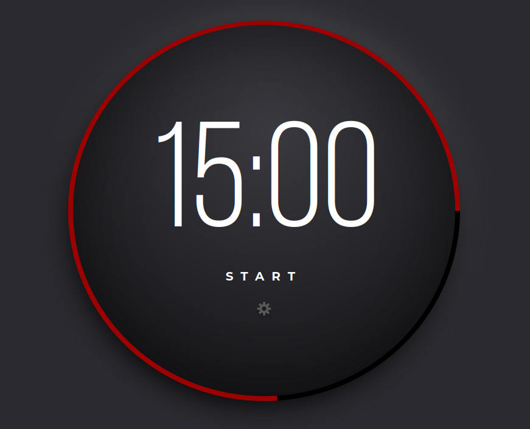
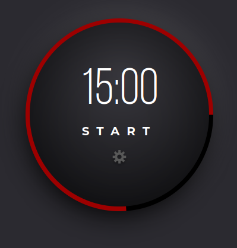

# Pomodoro Timer

> A challenge to create a Pomodoro timer to match the figma design and requirements.

## Table of contents

- [General info](#general-info)
- [Screenshots](#screenshots)
- [Technologies](#technologies)
- [Learnings](#learnings)
- [Setup](#setup)
- [Status](#status)
- [Inspiration](#inspiration)
- [Contact](#contact)

## General info

This is from Advent of CSS/JS day 1.

Brief:
Users should be able to:

- Start and Stop the Timer
- Click on the gear icon to change the length (minutes and seconds) for the timer.

And it should look like the Figma design given.

> For the CSS I tried out alphabetical ordering.

> For the JS I tried out Alpine JS.

## Screenshots




## Technologies

- HTML
- SCSS
- Vite
- Alpine JS

## Learnings

Alpine JS

## Setup

To view this project, visit the [demo](https://advent-of-css-and-js.pages.dev/) or download the files, open a terminal in that folder and install locally using npm:

```
npm install
```

Then run the app locally:

```
npm run dev
```

## Status

Project is: _finished_

## Inspiration

- [Advent of CSS](https://www.adventofcss.com/)
- [Advent of JS](https://www.adventofjs.com/)

## Contact

Created by [nicm42](https://twitter.com/nicm4242/) - feel free to contact me!
