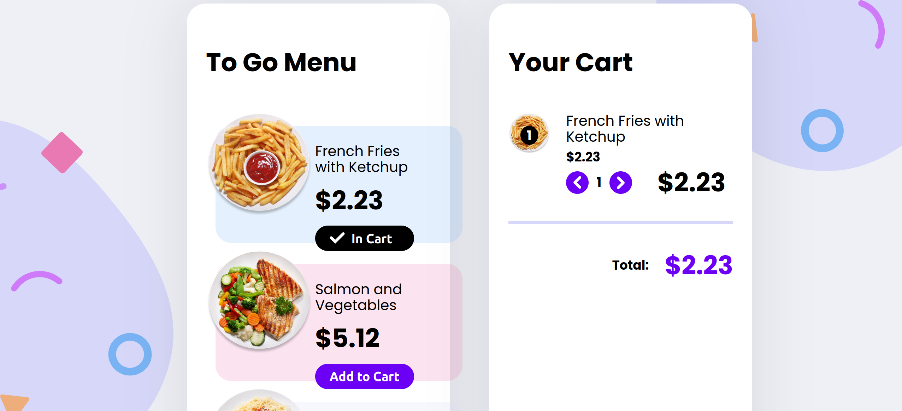

# eCommerce Component

> A challenge to create an eCommerce component to match the figma design and requirements.

## Table of contents

- [General info](#general-info)
- [Screenshots](#screenshots)
- [Technologies](#technologies)
- [Learnings](#learnings)
- [Setup](#setup)
- [Status](#status)
- [Inspiration](#inspiration)
- [Contact](#contact)

## General info

This is from Advent of CSS/JS day 2.

Brief:
Users should be able to:

- View the plates on the left side of the screen and add them to your cart on the right side.
- When there are no plates within your cart, you should see a message that says, "Your cart is empty."
- When a plate is added to your cart, the Subtotal and Totals will automatically update.
- When products are in your cart, you should be able to increase and decrease the quantity.
  - A user should not be able to mark the quantity as a negative number.
  - If the quantity goes down to 0, the user will have the option to delete or remove the product for their cart entirely.

(I ignored that last one since that's not how checkouts work. I also ignored the subtotal and tax as I don't understand that in America in real life)

And it should look like the Figma design given.

> For the CSS I tried out Css Modules.

> For the JS I tried out Vue.

## Screenshots




## Technologies

- Vue
- Vite
- CSS Modules

## Learnings

Vue
CSS Modules

## Setup

To view this project, visit the [Demo](https://advent-of-css-and-js-day2.netlify.app/) or download the files, open a terminal in that folder and install locally using npm:

```
npm install
```

Then run the app locally:

```
npm run dev
```

## Status

Project is: _finished_

## Inspiration

- [Advent of CSS](https://www.adventofcss.com/)
- [Advent of JS](https://www.adventofjs.com/)

## Contact

Created by [nicm42](https://twitter.com/nicm4242/) - feel free to contact me!
